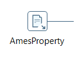
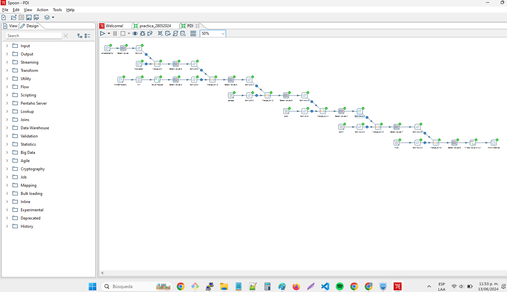

## Reporte Experimentación Proyecto Final Infraestructura

## Integrantes:

    - Mitchel Esteban Collazos Agredo
    - Kenny Rodríguez Escobar
    - Juan David Borja Marulanda
    - Víctor Julio Palencia Luna

## Entregables:

Un reporte de la experimentación que incluya:
- Introducción.
- Las actividades realizadas y lecciones aprendidas.
- Incluir referencias en caso de tenerlas (IEEE, ACM). - Proyecto PDI.
- ArchivoSalida csv.
  

## Lecciones Aprendidas:

- Aprendimos a utilizar la herramienta Pentaho para unir varias bases de datos de diferentes fuentes.

- Aprendimos a reducir pasos o nodos agregando una consulta sql a un sólo nod, incluía una transformación que posiblemente requeriría varios nodos.
    
- Aprendimos a realizar por medio de nodos, las transformaciones sobre los datos contenidos en las diferentes BDs.
    
- Durante la realización del proyecto aprendimos a aplicar los diferentes tipos de nodos de la herramienta Pentaho.
  

### Pasos previos a la creación del Pipeline

**1. Verificación del archivo csv:**

Se revisó el archivo de AmesProperty en googlesheets para verificar que no existen duplicados en PID. Adicionalmente se notó que "Lot Frontage" y "Year Remod/Add" tienen 290 y 1569 nulos respectivamente.

  

**2. Verificación de la base de datos relacional:**

En la tabla amesdbtemp se verificó que el número de valores únicos de la columna pid fuera 2930 tal como en el archivo csv.

  

De igual forma, se observaron el contenido de las tablas con SELECT * FROM [table], donde table es: mszoning, saleproperty y typequality para corroborar que sus llaves no tuvieran valores duplicados, y de esta forma, no generar duplicados en el resultado del join que se hará en el primer paso del pipeline de Pentaho.

**3. Verificación de la base de datos no estructurada de mongodb:**

A partir de la siguiente agregación se verificó que no hubieran valores repetidos de PID en la colección de bsmt:

  

La agregación agrupó los valores por PID y luego contó aquellos que fueran mayores a 1. Al ser vacío el resultado, se concluyó que los valores de PID son únicos.

Aplicando el mismo proceso con las demás colecciones, se pudo confirmar que es posible hacer joins entre la base de datos de mongodb, los datos del csv y los datos de la base de datos relacional en el pipeline de Pentaho.

### Paso a paso del Pipeline:

**1. Creamos una nueva transformación:**

  

**2. Configuración de la conexión:**

>>Asignamos las instancias correspondientes a los parámetros Host Name, Database Name, Port Number, Username y Password.

  

**3. Nodo amesdbtemp - Agregar nodo tipo "Table input"**

>> Se crea el primer nodo con los datos de la tabla que tiene todas las relaciones a las demás tablas, la tabla **amesdbtemp**.  Dentro de este nodo se inserta un consulta sql para:
- Calcular el **Gr Liv Area**.
- Traer campos de las tablas **mssubclass**, **mszoning** y **saleproperty**.
- Extraer el **Mo Sold** y el **Yr Sold**
- Ordenar por el PID de ammesdbtemp.
- Traer los campos de código y descripción de la tabla typequality para los valores de amesdbtemp de "Exter Qual", "Exter Cond", "Heating QC" y "Kitchen Qual"

   

**4. Nodo Select values - Agregar nodo tipo "Select values"**

>> Se agrega un nodo tipo Select values conectándolo con el nodo anterior, amesdbtemp, para especificar qué columnas se requieren que sigan en el flujo de datos en la siguiente etapa de transformación.

   

**5. Nodo Sort pid - Agregar nodo tipo "Sort"**

>> Agregar un nodo tipo Sort uniéndolo al nodo anterior, Select values, para ordenar el resultado de la consulta del nodo amesdbtemp en orden ascendente por el campo pid.

   

**6. Nodo floordetail - Agregar nodo tipo "Table input"**

>> Agregar nodo tipo Table input, e insertar una consulta sobre la tabla floordetail y en la misma consulta calcular el total de baños FullBath, HalfBath, Bedroom, agrupando por el pid y ordenando por este mismo.

   

**7. Nodo Merge join - Agregar nodo tipo "Merge join"**

>> Agregar nodo tipo merge join para unir los datos del resultado del paso Sort pid y floordetail.  Utilizamos LEFT OUTER JOIN para conservar todos los datos de la tabla resultado del paso Sort pid y adicionando los registros de la tabla floordetail cuyo pid coincida con los registros contenidos en el paso Sort pid.

   

**8. Nodo Select values 2 - Agregar nodo tipo "Select values"**

>> Se agrega un nodo tipo Select values conectándolo con el nodo anterior, Merge join, para especificar qué columnas se requieren que sigan en el flujo de datos en la siguiente etapa de transformación.

   

**9. Nodo Sort pid 2 - Agregar nodo tipo "Sort"**

>> Agregar un nodo tipo Sort uniéndolo al nodo anterior, Select values 2, para ordenar el resultado de la consulta del nodo Merge join en orden ascendente por el campo pid.

   

**10. Nodo AmesProperty - Agregar nodo tipo "CSV file input"**

>> Agregar un nodo tipo CSV file input para importar los datos del archivo AmesProperty.csv, para ordenar el resultado de la consulta del nodo Merge join en orden ascendente por el campo pid.

   

**11. Nodo Nvl - Agregar nodo tipo "Calculator"**

>> Agregar nodo tipo calculator enlazándolo al nodo AmesProperty para realizar la operación de reemplazar los valores nulos del campo Year Remod/Add por el valor del campo Year Built del nodo AmesProperty.

   

**12. Nodo Value mapper - Agregar nodo tipo "Value mapper"**

>> Agregar nodo tipo Value mapper enlazándolo al nodo anterior, Nvl, para realizar la operación de reemplazar los valores del campo Condition 1 a nombres mas extensos para hacerlos mas descriptivos.

   

**13. Nodo Select values 3 - Agregar nodo tipo "Select values"**

>> Se agrega un nodo tipo Select values conectándolo con el nodo anterior, Value mapper, para especificar qué columnas se requieren que sigan en el flujo de datos en la siguiente etapa de transformación.

   

**14. Nodo Sort pid 3 - Agregar nodo tipo "Sort"**

>> Agregar un nodo tipo Sort uniéndolo al nodo anterior, Select values 3, para ordenar el resultado de la consulta del nodo Nvl en orden ascendente por el campo PID.

   

**15. Nodo Merge join 2 - Agregar nodo tipo "Merge join"**

>> Agregar nodo tipo merge join para unir los datos del resultado del paso Sort pid 2 y Sort pid 3.  Utilizamos INNER JOIN para conservar los datos que coincidan en las dos tablas obtenidas del paso Sort pid 2 y Sort pid 3.

   

**16. Nodo Select values 5 - Agregar nodo tipo "Select values"**

>> Se agrega un nodo tipo Select values conectándolo con el nodo anterior, Merge join 2, para especificar qué columnas se requieren que sigan en el flujo de datos en la siguiente etapa de transformación.

   

**17. Nodo Sort pid 4 - Agregar nodo tipo "Sort"**

>> Agregar un nodo tipo Sort uniéndolo al nodo anterior, Select values 5, para ordenar el resultado de la consulta del nodo Merge join 2 en orden ascendente por el campo pid.

   

**18. Nodo garage - Agregar nodo tipo "MongoDB input"**

>> Agregar un nodo tipo MongoDB input para importar los datos de la colección garage desde mongodb. Se añade el link a la base de datos de Mongo en "Configure connection" y se valida que el servidor está activo y recibiendo solicitudes con "Test Connection". En "Input options" se añade la database "test" y la collection "garage" y finalmente en "Fields" se añaden los campos que se importan del datasource.

   

**19. Nodo Sort pid 5 - Agregar nodo tipo "Sort"**

>> Agregar un nodo tipo Sort uniéndolo al nodo anterior, garage, para ordenar el resultado del contenido de la colección garage en orden ascendente por el campo PID.

   

**20. Nodo Merge join 3 - Agregar nodo tipo "Merge join"**

>> Agregar nodo tipo merge join para unir los datos del resultado del paso Sort pid 4 y Sort pid 5.  Utilizamos LEFT OUTER JOIN para conservar todos los datos de la tabla resultado del paso Sort pid 4 y adicionando los registros de la tabla obtenida en el paso Sort pid 5 cuyo pid coincida con los registros contenidos en el paso Sort pid 4.

   

**21. Nodo Select values 6 - Agregar nodo tipo "Select values"**

>> Se agrega un nodo tipo Select values conectándolo con el nodo anterior, Merge join 3, para especificar qué columnas se requieren que sigan en el flujo de datos en la siguiente etapa de transformación.

   

**22. Nodo Sort rows 2 - Agregar nodo tipo "Sort"**

>> Agregar un nodo tipo Sort uniéndolo al nodo anterior, Select values 6, para ordenar el resultado del contenido del nodo Merge join 3 en orden ascendente por el campo pid.

   

**23. Nodo pool - Agregar nodo tipo "MongoDB input"**

>> Agregar un nodo tipo MongoDB input para importar los datos de la colección pool desde mongodb.

   

**24. Nodo Sort rows - Agregar nodo tipo "Sort"**

>> Agregar un nodo tipo Sort uniéndolo al nodo anterior, pool, para ordenar el resultado del contenido de la colección pool en orden ascendente por el campo PID.

   

**25. Nodo Merge join 4 - Agregar nodo tipo "Merge join"**

>> Agregar nodo tipo merge join para unir los datos del resultado del paso Sort rows 2 y Sort rows.  Aquí obtenemos como resultado todos los datos de la tabla obtenida en Sort rows 2 y los de la colección pool cuyo PID coincida con los registros de la tabla que ya traemos.

   

**26. Nodo Select values 4 - Agregar nodo tipo "Select values"**

>> Se agrega un nodo tipo Select values conectándolo con el nodo anterior, Merge join 4, para especificar qué columnas se requieren que sigan en el flujo de datos en la siguiente etapa de transformación.

   

**27. Nodo Sort rows 4 - Agregar nodo tipo "Sort"**

>> Agregar un nodo tipo Sort uniéndolo al nodo anterior, Select values 4, para ordenar el resultado del contenido del nodo Select values 4 en orden ascendente por el campo pid.

   

**28. Nodo bsmt - Agregar nodo tipo "MongoDB input"**

>> Agregar un nodo tipo MongoDB input para importar los datos de la colección bsmt desde mongodb.

   

**29. Nodo Sort rows 5 - Agregar nodo tipo "Sort"**

>> Agregar un nodo tipo Sort uniéndolo al nodo anterior, bsmt, para ordenar el resultado del contenido de la colección bsmt en orden ascendente por el campo PID.

   

**30. Nodo Merge join 5 - Agregar nodo tipo "Merge join"**

>> Agregar nodo tipo merge join para unir los datos del resultado del paso Sort rows 4 y Sort rows 5.  Aquí obtenemos como resultado todos los datos de la tabla obtenida en Sort rows 4 y los de la colección bsmt cuyo PID coincida con los registros de la tabla de Sort rows 4 que ya traíamos.

   

**31. Nodo Select values 7 - Agregar nodo tipo "Select values"**

>> Se agrega un nodo tipo Select values conectándolo con el nodo anterior, Merge join 5, para especificar qué columnas se requieren que sigan en el flujo de datos en la siguiente etapa de transformación.

   

**32. Nodo Sort rows 6 - Agregar nodo tipo "Sort"**

>> Agregar un nodo tipo Sort uniéndolo al nodo anterior, Select values 7, para ordenar el resultado del contenido del nodo Select values 7 en orden ascendente por el campo pid.

   

**33. Nodo misc - Agregar nodo tipo "MongoDB input"**

>> Agregar un nodo tipo MongoDB input para importar los datos de la colección **misc** desde mongodb.

   

**34. Nodo Sort rows 3 - Agregar nodo tipo "Sort"**

>> Agregar un nodo tipo Sort uniéndolo al nodo anterior, misc, para ordenar el resultado del contenido de la colección misc en orden ascendente por el campo PID.

   

**35. Nodo Merge join 6 - Agregar nodo tipo "Merge join"**

>> Agregar nodo tipo merge join para unir los datos del resultado del paso Sort rows 6 y Sort rows 3.  Aquí obtenemos como resultado todos los datos de la tabla obtenida en Sort rows 6 y los de la colección misc cuyo PID coincida con los registros de la tabla de Sort rows 6 que ya traíamos.

   

**36. Nodo Select values 8 - Agregar nodo tipo "Select values"**

>> Se agrega un nodo tipo Select values conectándolo con el nodo anterior, Merge join 6, para especificar qué columnas se requieren que sigan en el flujo de datos en la siguiente etapa de transformación.

   

**37. Nodo if field value is null - Agregar nodo tipo "Utility"**

>> Se agrega un nodo tipo Utility conectándolo con el nodo anterior, Select values 8, para configurar reemplazar valores nulos por 0 o por NA en todas las columnas de la tabla obtenida en el nodo Merge join 6.

   

**38. Nodo ArchivoSalida - Agregar nodo tipo "Text file output"**

>> Se agrega un nodo tipo Text file output conectándolo con el nodo anterior, if field value is null, para generar el archivo csv de salida que contendrá el resultado de las transformaciones, este nodo generará un archivo que se guarda en una ruta específica.

   

**39. Imagen completa del PDI**

   