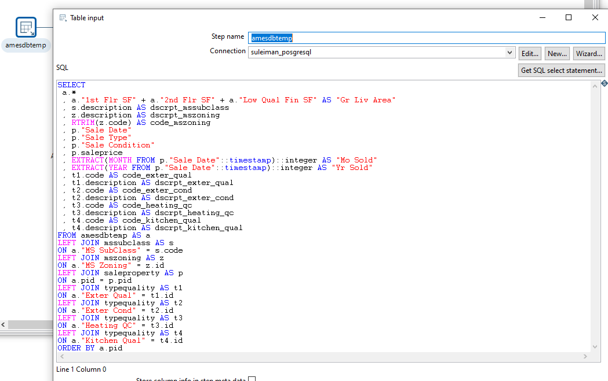
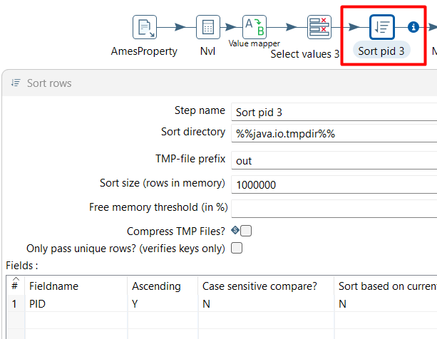

## Entregables: 

Un reporte de la experimentación que incluya:
- Introducción.
- Las actividades realizadas y lecciones aprendidas.
- Incluir referencias en caso de tenerlas (IEEE, ACM). - Proyecto PDI.
- ArchivoSalida csv.
  

### Paso a paso del Pipeline

**1. Creamos una nueva transformación:**

  

**2. Configuración de la conexión:**

>>Asignamos las instancias correspondientes a los parámetros Host Name, Database Name, Port Number, Username y Password.

  

**3. Nodo amesdbtemp - Agregar nodo tipo "Table input"**

>> Se crea el primer nodo con los datos de la tabla que tiene todas las relaciones a las demás tablas, la tabla **amesdbtemp**.  Dentro de este nodo se inserta un consulta sql para:
- Calcular el **Gr Liv Area**.
- Traer campos de las tablas **mssubclass**, **mszoning** y **saleproperty**.
- Extraer el **Mo Sold** y el **Yr Sold**
- Ordenar por el PID de ammesdbtemp.

   

**4. Nodo Select values - Agregar nodo tipo "Select values"**

>> Se agrega un nodo tipo Select values conectándolo con el nodo anterior, amesdbtemp, para especificar qué columnas se requieren que sigan en el flujo de datos en la siguiente etapa de transformación.

   

**5. Nodo Sort pid - Agregar nodo tipo "Sort"**

>> Agregar un nodo tipo Sort uniéndolo al nodo anterior, Select values, para ordenar el resultado de la consulta del nodo amesdbtemp en orden ascendente por el campo pid.

   

**6. Nodo floordetail - Agregar nodo tipo "Table input"**

>> Agregar nodo tipo Table input, e insertar una consulta sobre la tabla floordetail y en la misma consulta calcular el total de baños FullBath, HalfBath, Bedroom, agrupando por el pid y ordenando por este mismo.

   

**7. Nodo Merge join - Agregar nodo tipo "Merge join"**

>> Agregar nodo tipo merge join para unir los datos del resultado del paso Sort pid y floordetail.

   

**7. Nodo Select values 2 - Agregar nodo tipo "Select values"**

>> Se agrega un nodo tipo Select values conectándolo con el nodo anterior, Merge join, para especificar qué columnas se requieren que sigan en el flujo de datos en la siguiente etapa de transformación.

   

**8. Nodo Sort pid 2 - Agregar nodo tipo "Sort"**

>> Agregar un nodo tipo Sort uniéndolo al nodo anterior, Select values 2, para ordenar el resultado de la consulta del nodo Merge join en orden ascendente por el campo pid.

   

**. Nodo AmesProperty - Agregar nodo tipo "CSV file input"**

>> Agregar un nodo tipo CSV file input para importar los datos del archivo AmesProperty.csv, para ordenar el resultado de la consulta del nodo Merge join en orden ascendente por el campo pid.

   

**. Nodo Nvl - Agregar nodo tipo "Calculator"**

>> Agregar nodo tipo calculator enlazándolo al nodo AmesProperty para realizar la operación de reemplazar los valores nulos del campo Year Remod/Add por el valor del campo Year Built del nodo AmesProperty.

   

**. Nodo Select values 3 - Agregar nodo tipo "Select values"**

>> Se agrega un nodo tipo Select values conectándolo con el nodo anterior, Nvl, para especificar qué columnas se requieren que sigan en el flujo de datos en la siguiente etapa de transformación.

   

**. Nodo Sort pid 3 - Agregar nodo tipo "Sort"**

>> Agregar un nodo tipo Sort uniéndolo al nodo anterior, Select values 3, para ordenar el resultado de la consulta del nodo Nvl en orden ascendente por el campo PID.

   

**. Nodo Merge join 2 - Agregar nodo tipo "Merge join"**

>> Agregar nodo tipo merge join para unir los datos del resultado del paso Sort pid 2 y Sort pid 3.

   

**. Nodo Select values 5 - Agregar nodo tipo "Select values"**

>> Se agrega un nodo tipo Select values conectándolo con el nodo anterior, Merge join 2, para especificar qué columnas se requieren que sigan en el flujo de datos en la siguiente etapa de transformación.

   

**. Nodo Sort pid 4 - Agregar nodo tipo "Sort"**

>> Agregar un nodo tipo Sort uniéndolo al nodo anterior, Select values 5, para ordenar el resultado de la consulta del nodo Merge join 2 en orden ascendente por el campo pid.

   

**. Nodo garage - Agregar nodo tipo "MongoDB input"**

>> Agregar un nodo tipo MongoDB input para importar los datos de la colección garage desde mongodb.

   

**. Nodo Sort pid 5 - Agregar nodo tipo "Sort"**

>> Agregar un nodo tipo Sort uniéndolo al nodo anterior, garage, para ordenar el resultado del contenido de la colección garage en orden ascendente por el campo PID.

   

**. Nodo Merge join 3 - Agregar nodo tipo "Merge join"**

>> Agregar nodo tipo merge join para unir los datos del resultado del paso Sort pid 4 y Sort pid 5.

   

**. Nodo Select values 6 - Agregar nodo tipo "Select values"**

>> Se agrega un nodo tipo Select values conectándolo con el nodo anterior, Merge join 3, para especificar qué columnas se requieren que sigan en el flujo de datos en la siguiente etapa de transformación.

   

**. Nodo Sort rows 2 - Agregar nodo tipo "Sort"**

>> Agregar un nodo tipo Sort uniéndolo al nodo anterior, Select values 6, para ordenar el resultado del contenido del nodo Merge join 3 en orden ascendente por el campo pid.

   